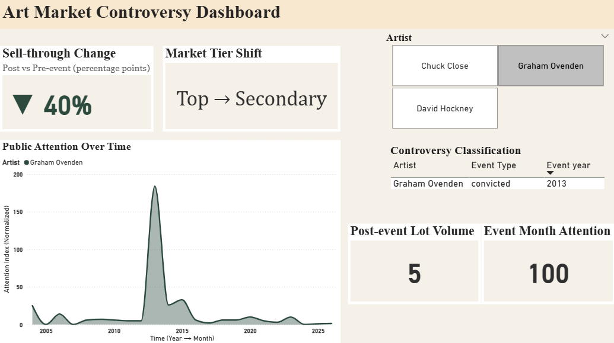
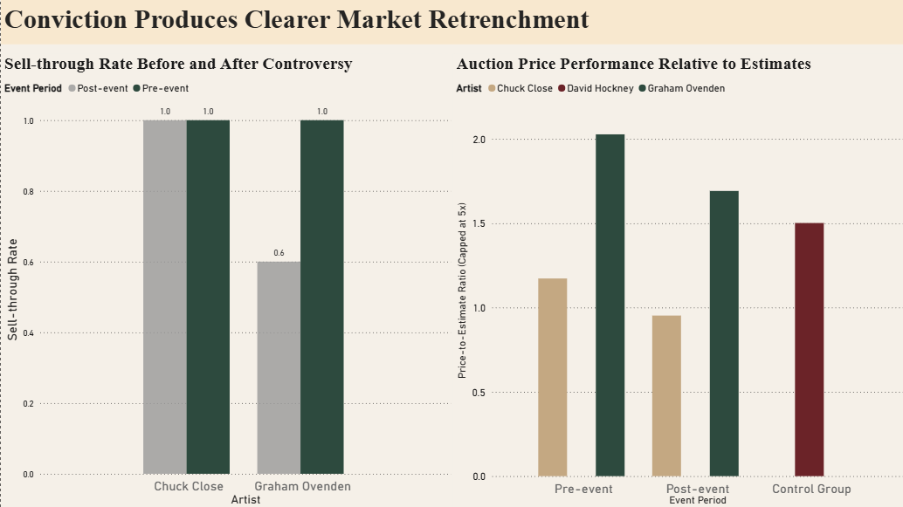
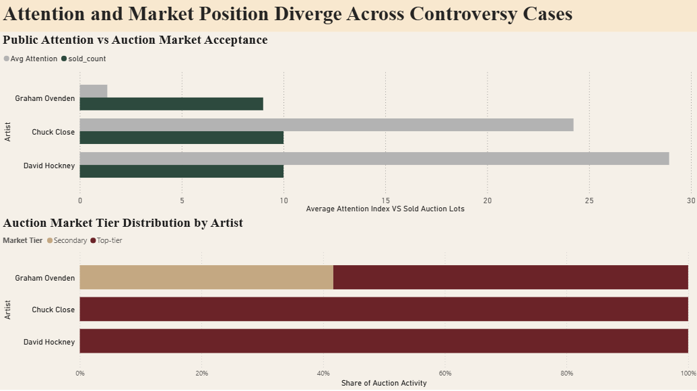
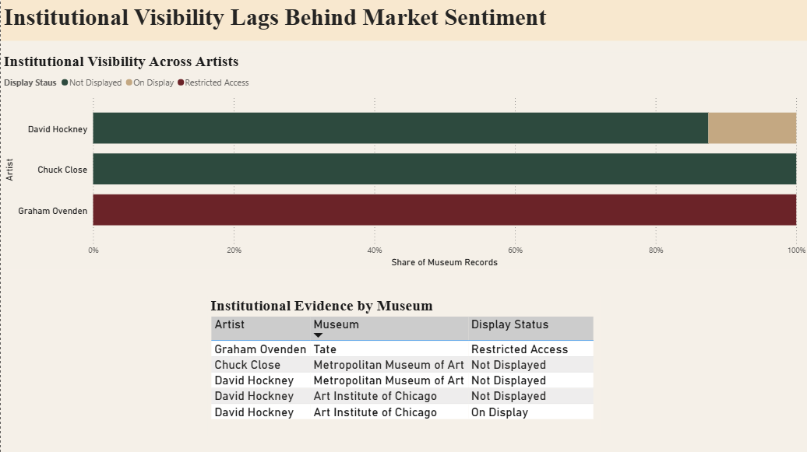
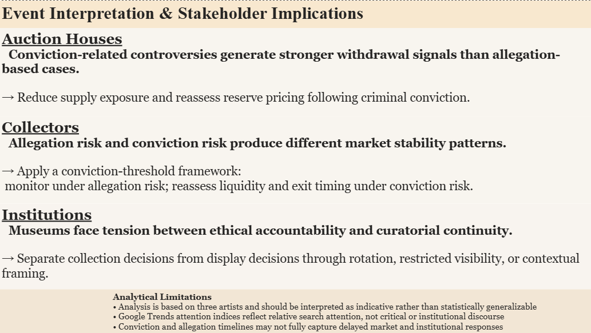

# Art Market Decision Framework under Controversy

When an artist is accused or convicted, how does the market respond?

This project builds a data-driven decision framework for interpreting controversy in the art market, drawing on auction records, public attention signals, and institutional behavior across three artist case studies.



---

## Why This Project Matters

Art markets operate under significant reputational uncertainty, yet institutional and market responses to controversy remain difficult to interpret systematically.

This project explores how allegations and criminal convictions produce different market, attention, and institutional reactions, and how these signals may inform stakeholder decision-making under reputational risk.

---

## Objective

This project investigates whether and how controversy impacts an artist’s market trajectory.

Specifically, it examines:

- Do markets penalize artists facing allegations versus criminal convictions?
- Does public attention translate into market activity?
- How do institutional signals (e.g. museum display status) align with market behavior?
- What strategic actions should stakeholders take in response?

The goal is to move beyond descriptive analysis and develop a decision-oriented framework for interpreting controversy in the art market.

---

## Dashboard Narrative Structure

The dashboard was designed using a decision-first storytelling approach:

1. Executive overview
2. Market reaction
3. Attention and repositioning
4. Institutional signal
5. Stakeholder recommendation

---

## Data & Methodology

The analysis integrates three core data layers:

### Auction Market Data
- Sell-through rate
- Lot volume
- Market tier (top-tier vs secondary)

### Public Attention Data
- Google Trends-based attention index (normalized)

### Institutional Signal Data
- Museum presence and display status

Data was processed using SQL (data modeling and aggregation) and analyzed through Power BI for interactive visualization and storytelling.

A pre/post event framework is used to evaluate changes around controversy events.

Extreme price-to-estimate ratios above 5 were capped to reduce distortion from anomalous auction outcomes before calculating average market confidence metrics.

---

# Dashboard Structure

## 1. Executive Overview

- KPI monitoring across controversy types
- Artist-level filtering through slicer interaction
- High-level comparison of market and institutional behavior


---

## 2. Market Reaction

- Pre vs post sell-through comparison
- Auction price performance relative to estimates
- Comparison between allegation-based and conviction-based market reactions



---

## 3. Attention & Market Position

- Public attention trends surrounding controversy events
- Comparison between attention spikes and auction activity
- Post-event shifts between top-tier and secondary-market positioning



---

## 4. Institutional Signal

- Museum display visibility analysis
- Institutional conservatism versus market reaction
- Display management under reputational pressure



---

## 5. Stakeholder Implications

- Action-oriented interpretation framework
- Stakeholder-specific recommendations under reputational uncertainty
- Decision support for auction houses, collectors, and institutions



---

# Key Insights

- Conviction-related controversy generated a **40 percentage-point decline in sell-through performance** for Graham Ovenden, while Chuck Close maintained comparatively stable auction performance following allegation-based controversy.

- Public attention and market response did not move uniformly:
  - Graham Ovenden recorded the strongest event-period attention spike
  - Auction participation and pricing confidence nevertheless weakened post-event

- Auction activity shifted away from top-tier institutions after controversy events:
  - Pre-event transactions were concentrated in Christie’s and Sotheby’s
  - Post-event activity increasingly appeared in secondary-market platforms

- Institutional responses remained comparatively stable and conservative:
  - Museum records continued to retain or display works despite observable market repositioning
  - Institutional visibility adjusted more slowly than auction-market behaviour

- The findings suggest that controversy severity influences stakeholder behaviour differently:
  - Allegation-based cases produced more ambiguous market reactions
  - Conviction-based cases generated clearer withdrawal signals across both markets and institutions

---

# Business Implications

This framework provides stakeholder-oriented decision support under reputational uncertainty:

### Auction Houses
- Implement staged reputational-risk responses, including supply reduction and reserve price reassessment following criminal conviction

### Collectors
- Differentiate between allegation risk and conviction risk when evaluating liquidity, market stability, and exit timing

### Institutions
- Separate collection ownership decisions from public display management through contextual framing, rotation, or restricted visibility strategies

The project demonstrates how analytical frameworks can support cultural-market decision-making under conditions of reputational shock, institutional tension, and market uncertainty.

---

# Analytical Limitations

- Analysis is based on three artists and should be interpreted as indicative rather than statistically generalizable
- Google Trends attention indices reflect relative search attention rather than critical, institutional, or curatorial discourse
- Controversy timelines may not fully capture delayed market and institutional response windows

---

# Tools & Technologies

| Tool | Purpose |
|---|---|
| SQL | Data modeling, aggregation, analytical views |
| Power BI | Interactive dashboard development and storytelling |
| DAX | KPI and calculated measure development |
| Google Trends | Public attention signal extraction |

---

# Repository Structure

```text
dashboard/
    art_market_controversy_dashboard.pbix

sql/
    analysis_queries.sql

screenshots/
    dashboard screenshots used in README

README.md
